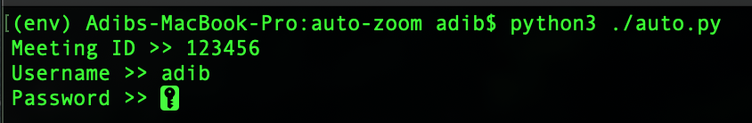

## Zoom class automation script

[Demo](https://youtu.be/OruyfGMukUk)

This is a zoom automation script I built for personal use . This only has been tested on macOS , even though primary support for `windows` is enabled but hasn't been tested . If you want to run on windows please navigate to `auto.py` and on line 81 replace `os.startfile("C:\\myprogram.exe")` replace `myprogram.exe` with zoom app exe file path .

### Requirements
You need the latest python 3 installed on your computer and please install the dependencies via `pip install -r requirements.txt`

### How to run
`python3 ./auto.py`

You will be prompted to input Meeting ID , Username (the name to show on the meeting) , Password , like this :

<br />

`auto-zoom` has the capability to schedule zoom meetings . Please use the following format (HH:MM:SS) :
```txt
09:00:00
10:00:00
11:00:00
```

If `meetings.txt` file is empty , script will automatically log you in a zoom meeting (specified during startup)

DO NOT DELETE `meetings.txt` file and use correct format properly or the script might not work .
ALSO YOUR CREDENTIALS ARE SAVED IN A FILE CALLED `keys` . DO NOT DELETE THIS FILE or else you have to login the next time .

If this doesn't work that means the script hasn't been tested on that specific OS . Open an issue if script fails to work .

Please don't misuse this script , created as a side project only
